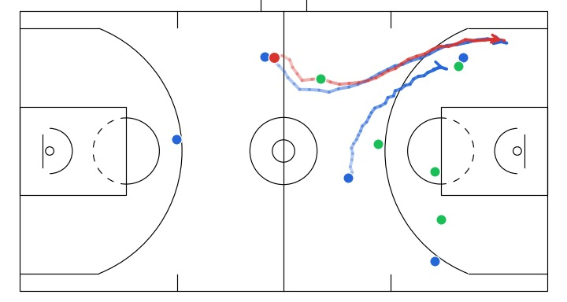
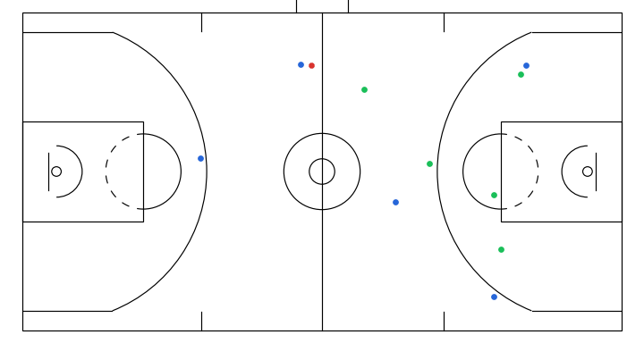

# gameplay-trajectory-diffusion

A DDPM for **sketch-guided trajectory simulation**: given a sparse, sketch-like set of observed positions across agents and timesteps as conditioning, the model generates a complete multi-agent gameplay simulation.

| Sketched conditioning | Simulated rollout |
| :---: | :---: |
|  |  |

The left panel illustrates the sparse conditioning observations passed to the model; the right shows a full gameplay simulation rolled out by the diffusion model.

## Setup

```bash
uv sync
source .venv/bin/activate
```

Trajectory data is loaded from `.npy` files of shape `(N, T, A, 2)`. Defaults in [configs/data/trajectory_nba_filling.yaml](configs/data/trajectory_nba_filling.yaml) point to `data/nba_train.npy` and `data/nba_test.npy`; place files there or override `data.params.train_path` / `data.params.val_path` via Hydra.

## Training

The Hydra entry point is [train.py](train.py), defaulting to [configs/train_trajectory_filling_ddpm.yaml](configs/train_trajectory_filling_ddpm.yaml):

```bash
python train.py --config-name=train_trajectory_filling_ddpm_dit_mixedmask_learnsigma
```

Each run writes its checkpoints and a resolved `config.yaml` under `checkpoints/<wandb_project>/<run_id>/`. The sampling script reads that `config.yaml` from next to the `.ckpt`, so keep them together.

## Validation masks

For comparable validation metrics across epochs, pregenerate a fixed mask of shape `[N_val, T, A]` and point the data config at it:

```bash
python scripts/pregenerate_trajectory_masks.py \
    --input data/nba_test.npy \
    --output tmp/val_masks_pregen.npy \
    --seed 42
```

Edit the `MASKING` dict at the top of [scripts/pregenerate_trajectory_masks.py](scripts/pregenerate_trajectory_masks.py) to match your validation protocol (same schema as `data.params.masking.train`). Then wire it into training:

```bash
python train.py data.params.masking.val_mask_path=tmp/val_masks_pregen.npy
```

## Sampling

Use [scripts/sample_trajectory_ddpm.py](scripts/sample_trajectory_ddpm.py) with a trained checkpoint:

```bash
python scripts/sample_trajectory_ddpm.py \
    --checkpoint checkpoints/<project>/<run_id>/<file>.ckpt \
    --num-samples 8 \
    --save-videos
```

You can create your own conditioning sketches via this [app](https://github.com/wezteoh/gameplay-trajectory-canvas). To condition on your own sketches, pass `--input-dir <dir>` where each immediate subdirectory contains a `traj.npy` (court XY, shape `(T, A, 2)`) and a `mask.npy` (shape `(T, A)`); outputs are written under `tmp/<output-subdir>/<subdir>/`.

## Acknowledgments

The trajectory datasets used in this project are kindly open-sourced by [MediaBrain-SJTU/LED](https://github.com/MediaBrain-SJTU/LED).
Implementation details in `src/modules/diffusion/gaussian_diffusion.py` and `src/modules/diffusion/diffusion_utils.py` heavily reference [facebookresearch/DiT](https://github.com/facebookresearch/DiT).

Pretrained checkpoint: Hugging Face — link coming soon.
